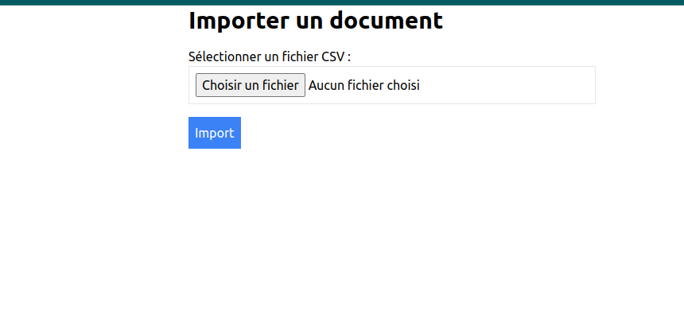
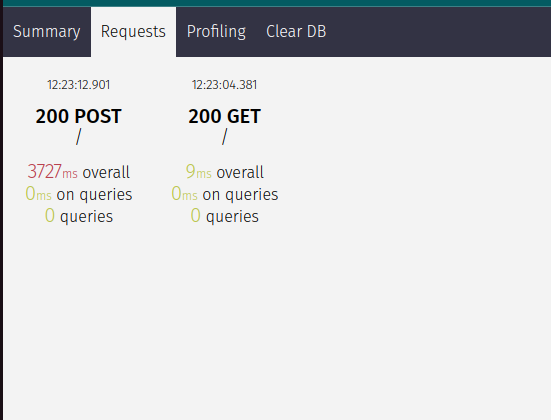

## Test import Asynchrone

### 1. Setup de l'application

Installer les dépendances python.
```bash
pip install -r requirements.txt
```
Par default, le projet utilise une base de données sqlite.
Je n'ai pas ignoré la db pour que vous puissiez voir les données.

Le compte admin de test:
- username: admin
- password: vieenrose

### 2. Import Asynchrone du CSV

Pour importer le fichier CSV, il suffit de se rendre sur la page d'accueil, 
d'ajouter le fichier csv fournis et de cliquer sur le bouton importer.



### 3. Performance
l'import asynchrone n'est pas bloquant pour l'utilisateur.
Le temps de 4s correspont au temps d'upload du fichier, l'import commence et l'utilisateur est redirigé vers la page de success.



### 4. Admin


Avec 37895 lignes


Avec 49974 lignes

### 5. API
L'API est disponible à l'adresse suivante:

Détail d'un document:
```bash
http://localhost:8000/api/documents/:num_doss:/
```


Liste des documents:
```bash
http://localhost:8000/api/documents/
```

Par defaut les data sont paginées par 100.


Il y a aussi la possibilite de de changer de page en ajoutant le paramètre `?page_num=2` à la fin de l'url.
D'avoir plus de data en ajoutant le paramètre `?page_size=200` à la fin de l'url.


### 6. Test
Pour lancer les tests:
```bash
pytest
```


### 7. Conclusion
Le projet est fonctionnel, mais il y a encore des améliorations à faire.

Temps de dev: ~4h
